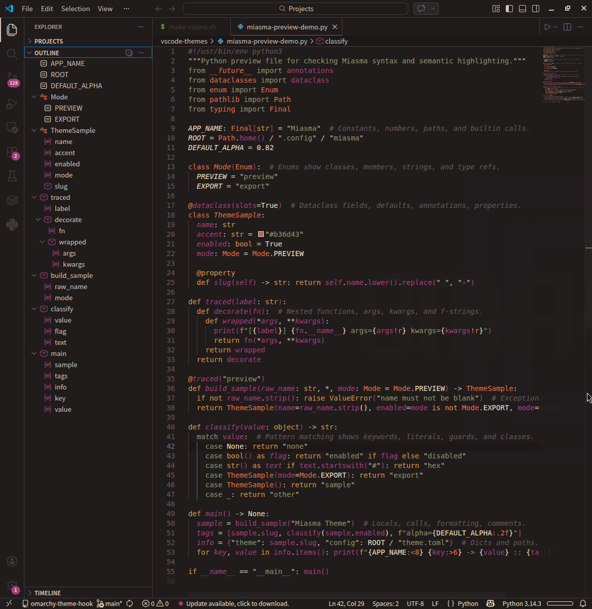

<p align="center">
  
</p>

# Biscuit Theme

Biscuit for VS Code.

Built from the Omarchy Biscuit palette and tuned for stronger syntax and semantic highlighting across the languages most people actually use.



## Install

Install from the VS Code Marketplace:

```bash
code --install-extension oldjobobo.biscuit-theme
```

## Included

- Dark Biscuit UI theme
- Semantic highlighting support
- Expanded syntax highlighting coverage for Rust, JavaScript, TypeScript, Python, Shell, Markdown, CSS, JSON, TOML, YAML, HTML, Lua, and diff views

## Highlighting Coverage

- `391` TextMate scopes themed
- `52` semantic token selectors themed
- Semantic highlighting enabled by the theme

## Palette

- Background: `#1A1515`
- Foreground: `#DCC9BC`
- Accent: `#AE3F82`
- Error: `#CF223E`
- Warning: `#E39C45`
- Success: `#959A6B`

## Notes

- Semantic highlighting is enabled by the theme.
